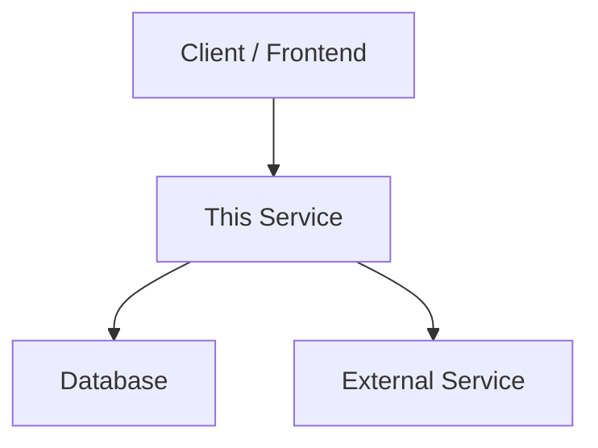
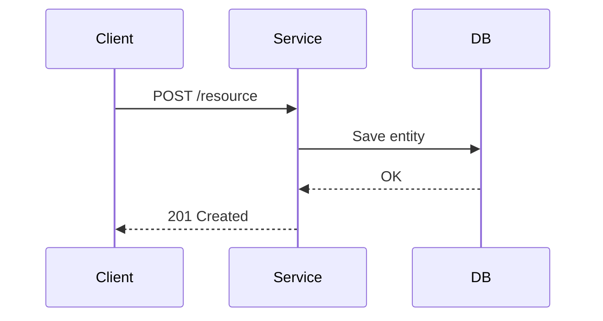

# README.md Generation Prompt (for Apidog)

You are a technical documentation expert. Your task is to generate a comprehensive `README.md` file for this service/API that will be published in Apidog.

## Context

- A Swagger/OpenAPI file is already attached separately in Apidog — do **NOT** regenerate it.
- `README.md` must complement the Swagger by explaining the **"why"** and **"how"**, not just the **"what"**.
- Audience: Developers, Solution Architects, **and** Product Owners / Business stakeholders.

## README.md Structure to Generate

### 1. Service Overview
- What this service does in plain language (non-technical first paragraph)
- Business purpose and value it provides
- Who uses this service and in what scenarios

### 2. Architecture & Responsibilities
- Where this service sits in the overall system
- What it owns (data, logic, integrations)
- What it does **NOT** do (boundaries)
- Include a Mermaid diagram showing service position:

### 3. Key Concepts & Domain Glossary
- Define domain terms used in the API (especially important for Product Owners)
- Explain business entities this service operates on

### 4. Main Flows
For each major business flow, include:
- Plain language description
- Mermaid sequence diagram, for example:

### 5. API Methods Summary
Even though Swagger exists, add a human-readable summary table:

| Method | Endpoint | Description | Who uses it |
|--------|----------|--------------|--------------|
| POST   | /example | Creates ...  | Mobile app   |

For key/complex endpoints add:
- Business purpose (not just technical)
- Important request/response fields explained in plain language
- Error scenarios and what they mean for the caller

### 6. Authentication & Authorization
- How to authenticate
- Roles/permissions model explained in business terms

### 7. Integration Guide
- How other services / teams integrate with this service
- Environment URLs (dev / staging / prod placeholders)
- Rate limits, SLAs if applicable

### 8. Error Handling
- Common error codes with business-friendly explanations
- What the caller should do in each case

### 9. FAQ
- Answer common questions from Product Owners, frontend devs, and QA

---

## Instructions

1. Analyze the codebase / controllers / service layer to understand what this service actually does.
2. Write the Overview section so a non-technical Product Owner can understand it in 2 minutes.
3. Write technical sections so a developer can integrate without reading the whole Swagger.
4. Use Mermaid diagrams wherever a flow or relationship is better shown visually than described.
5. Keep language clear, avoid unnecessary jargon — if jargon is used, define it.
6. **Output format:** pure Markdown, ready to paste into the Apidog README tab.
